# מדד (ctrmadad.com): מדריך למטפלות ולמטפלים

מדד שולח שאלונים למטופלים שלכם ומציג לכם את התוצאות שלהם לאורך זמן. המטופלים
לא צריכים להתקין דבר. אתם לא צריכים לטפל בקבצים או ליצור חשבון.

**כך זה עובד:** יוצרים קישור ← המטופל עונה בטלפון ← מתקבל אצלכם אימייל ←
פותחים את סיכום המטופל.

## לפני שמתחילים

- במסגרת ההכשרה תקבלו רשימה של **מזהי מטופלים** בתבנית `XXXX-XXXX`
  (לדוגמה, `K7M3-9QR7`).
- הקצו לכל מטופל מזהה משלו, ורשמו אצלכם איזה מזהה שייך לאיזה מטופל.
  המערכת לעולם אינה שומרת שמות, ולכן הרשימה שלכם היא המקום היחיד שמקשר
  בין מזהה לבין אדם.
- מדד פועל בכל דפדפן, במחשב או בטלפון.

---

## בקצרה: שליחת שאלון בשלושה צעדים {.newpage}

1. **בוחרים שאלון.** סמנו את סוללת ההכשרה.
2. **מזינים את מזהה המטופל.**
3. **המטופל סורק את קוד ה-QR** במצלמת הטלפון שלו.

זהו. המטופל עונה בטלפון, ואתם מקבלים אימייל כשהוא מסיים.

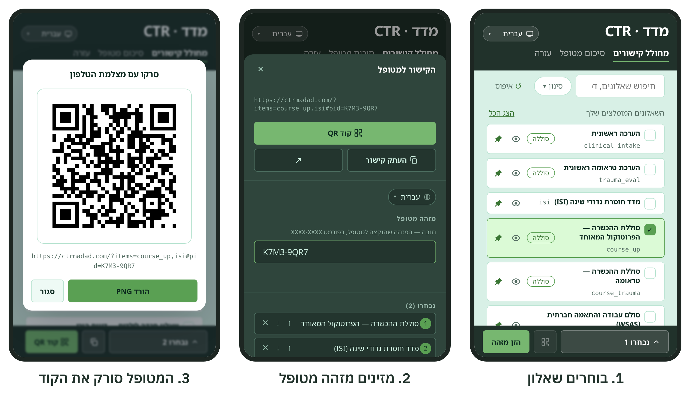

---

## 1. יצירת קישור למטופל

היכנסו אל **[ctrmadad.com/composer](https://ctrmadad.com/composer/)** (הלשונית **מחולל קישורים**), או סרקו
את הקוד הזה במצלמת הטלפון:

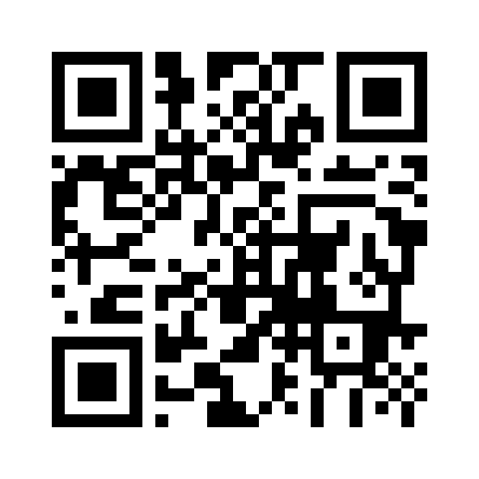

מחולל הקישורים פועל באותו אופן במחשב ובטלפון, וכל תמונה בהמשך מציגה את
שניהם: המחשב משמאל, הטלפון מימין.

- **במחשב**, קטלוג השאלונים נמצא מימין. בחלונית הכהה משמאל נמצאים הקישור,
  מזהה המטופל ורשימת השאלונים שנבחרו.
- **בטלפון**, אותה חלונית נפתחת מהסרגל שבתחתית המסך: הקישו על **נבחרו**.
  בסרגל נמצא גם כפתור **קוד QR**.

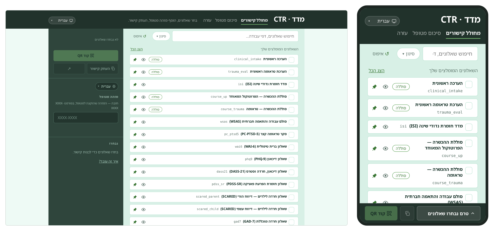

### בחירת סוללת ההכשרה

סמנו את הסוללה של ההכשרה שלכם (**סוללת ההכשרה**). היא כבר כוללת את
השאלונים הנדרשים.

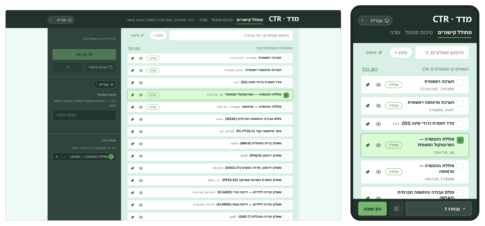

### רשות: הוספת שאלונים

רשימת השאלונים שאתם רואים היא השאלונים הנפוצים שאנחנו ממליצים עליהם.
שאלונים נוספים אפשר למצוא בחיפוש (לפי שם או נושא) או בכפתור **הצג הכל**.
**כפתור הנעץ** מאפשר לכם לשנות את הרשימה הראשונית שאתם רואים, לפי הצורך
וההרגלים שלכם.

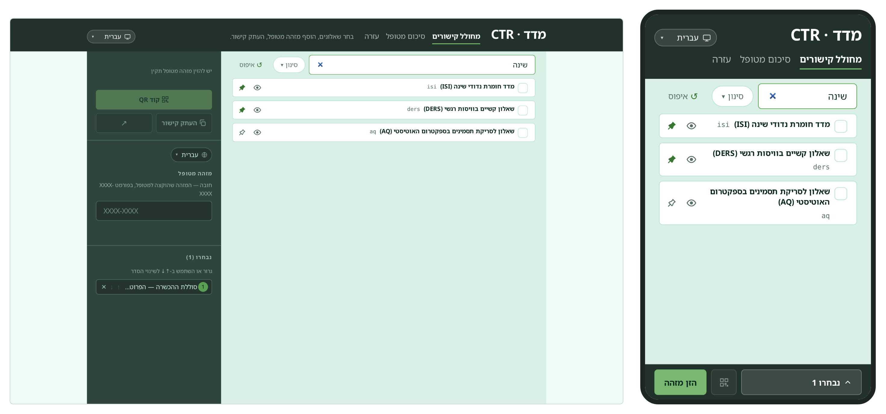

כדי לראות מה מכיל כל שאלון, לחצו על **כפתור העין**.

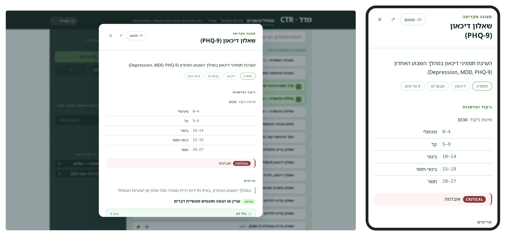

הרשימה **נבחרו** מציגה את הסדר שבו המטופל יראה את השאלונים; גררו כדי לשנות
את הסדר (בטלפון: ↑ ↓), או לחצו על × כדי להסיר שאלון.

### הזנת מזהה המטופל

הקלידו את מזהה המטופל בשדה **מזהה מטופל**. הקישור יופיע רק לאחר הזנת
מזהה תקין. טעות בהקלדה תזוהה מיד. בטלפון, הקישו על **הזן מזהה** בסרגל
התחתון כדי לפתוח את החלונית.

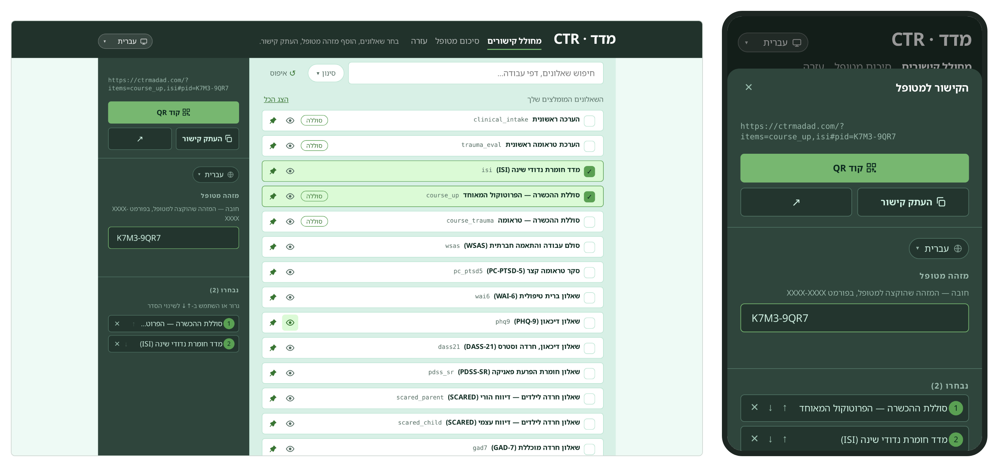

> מזהים שכבר השתמשתם בהם בדפדפן הזה יוצעו לכם בזמן ההקלדה.

### מסירת הקישור למטופל

הדרך המומלצת היא **קוד QR**: לחצו עליו, והמטופל סורק את הקוד במצלמת הטלפון
שלו, עוד בחדר. הקישור עובר ישירות, בלי להקליד ובלי לשלוח הודעות.

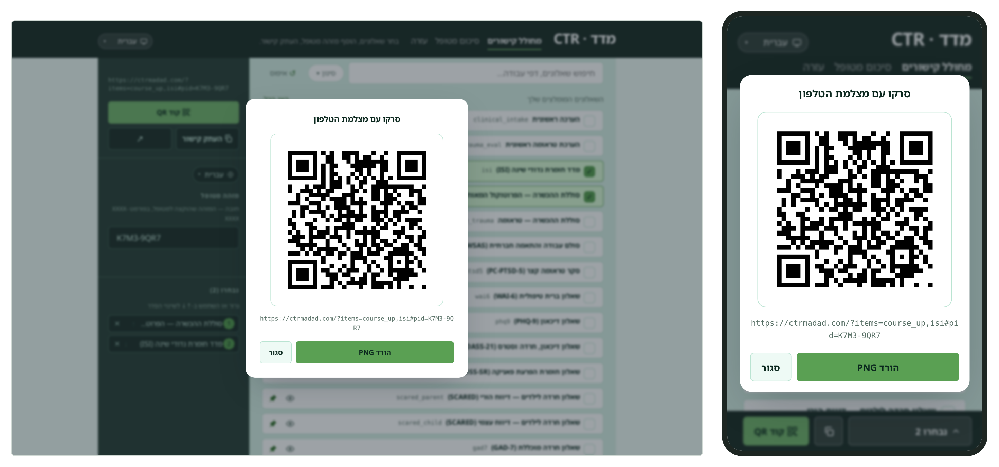

אפשר גם לשלוח את הקישור בדרך אחרת:

- **העתק קישור** מעתיק את הקישור, כדי להדביק אותו בהודעה או באימייל.
- **שתף** (במכשירים שתומכים בכך, בעיקר בטלפון) פותח את תפריט השיתוף של
  המכשיר.
- **↗** (פתח קישור) פותח את השאלון אצלכם, כדי לראות מה המטופל יראה.

> כל קישור משויך למזהה מטופל אחד. צרו קישור חדש לכל מטופל.

---

## 2. מה המטופל רואה

המטופל פותח את הקישור ולוחץ על **התחל**. במסך הראשון מוסבר לו שהתשובות
נשלחות למטפל שלו ללא שמו. כל שאלון מתחיל בהנחיות קצרות, ולאחר מכן מוצגת
שאלה אחת בכל פעם. בסיום, המטופל רואה את הציונים שלו ואישור לכך שהתוצאות
נשלחו אליכם. הוא אינו צריך לעשות דבר נוסף. הורדת קובץ ה-PDF היא רשות.

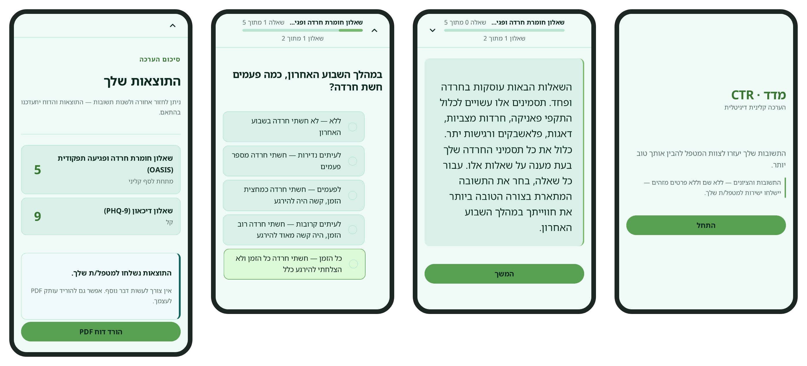

---

## 3. האימייל שתקבלו {.newpage}

כאשר מטופל מסיים, תקבלו אימייל ובו מזהה המטופל וקישור לסיכום שלו.
**האימייל לעולם אינו כולל ציונים או שמות.**

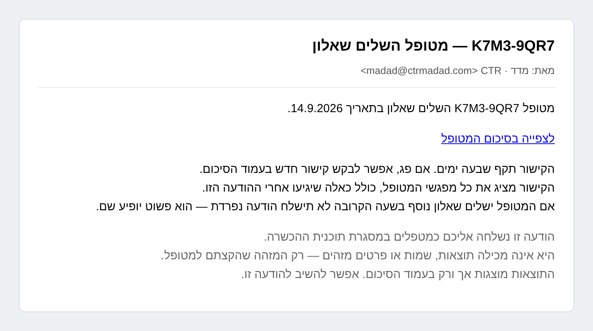

- הקישור תקף למשך **7 ימים**.
- קישור אחד מציג את **כל** המפגשים של אותו מטופל, כולל מפגשים שיתווספו
  בהמשך.
- אם המטופל עונה שוב בתוך שעה, לא יישלח אימייל נוסף. המפגש החדש פשוט יופיע
  בסיכום.

---

## 4. סיכום המטופל {.newpage}

לחצו באימייל על **לצפייה בסיכום המטופל**. תראו כרטיס אחד לכל שאלון, ובו
כל המפגשים שהמטופל השלים.

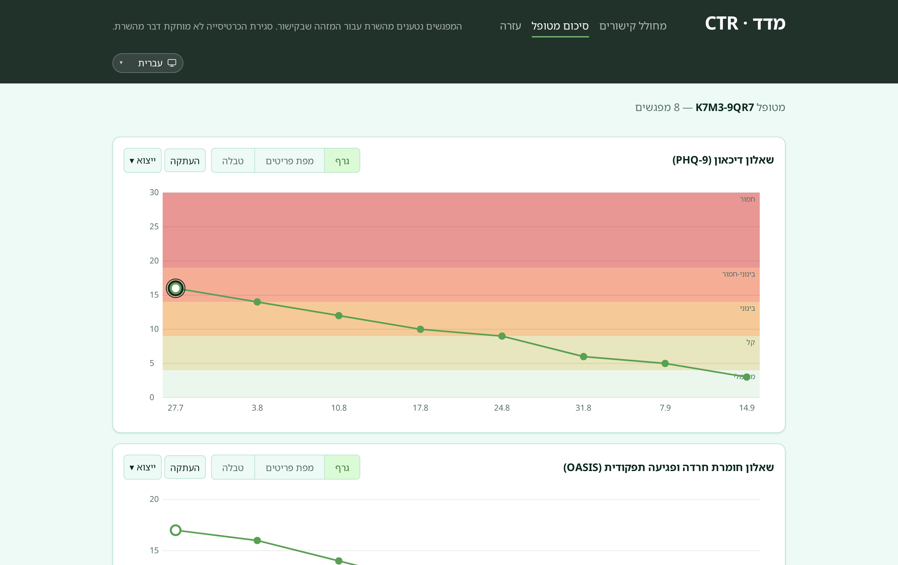

### גרף

רצועות צבעוניות מסמנות את טווחי החומרה. נקודה מוקפת בטבעת מסמנת מפגש
שהפעיל התראה.

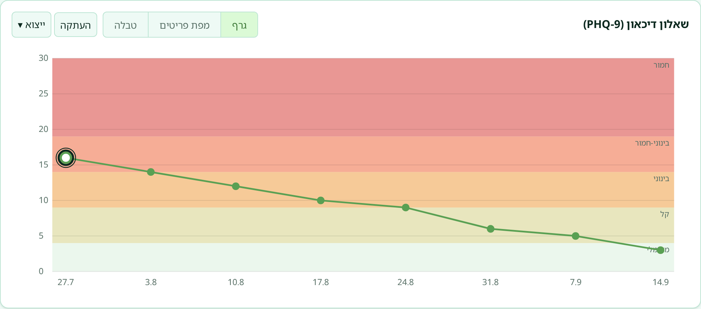

לחצו על נקודה כלשהי כדי לראות את פרטי המפגש: הציון, ההתראות אם היו,
וכל התשובות.

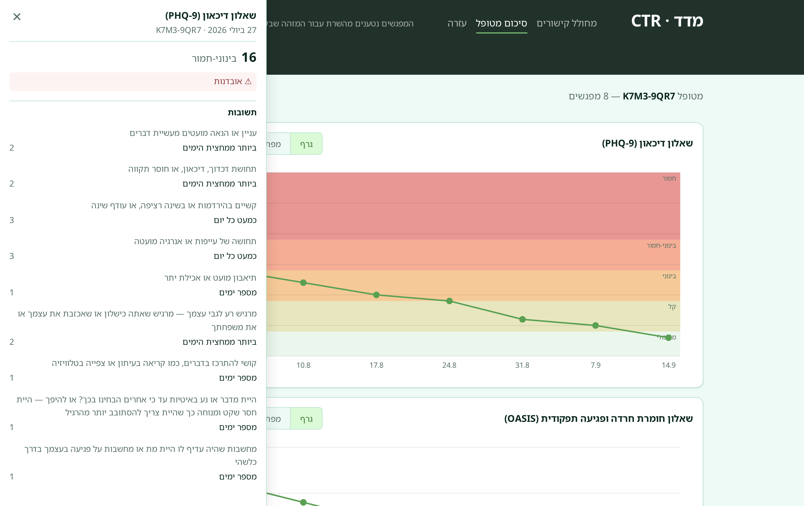

### מפת פריטים

כל פריט, מפגש אחר מפגש. המפה מראה אילו תסמינים משתנים.

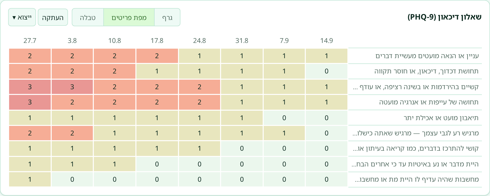

### טבלה

תאריכים, ציונים, דרגת חומרה והתראות בתצוגת טבלה.

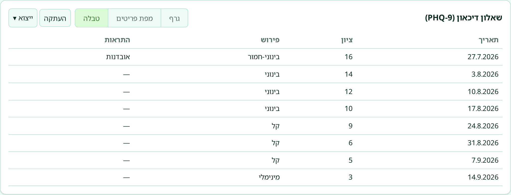

**העתקה** מעתיקה את הגרף כתמונה (שאפשר להדביק במסמך או ברשומה קלינית).
**ייצוא** מוריד אותו כקובץ PNG או SVG.

---

## 5. קבלת קישור חדש

אם פג תוקף הקישור, תופיע הודעה על כך בעמוד. לחצו על **שלחו לי קישור חדש**.

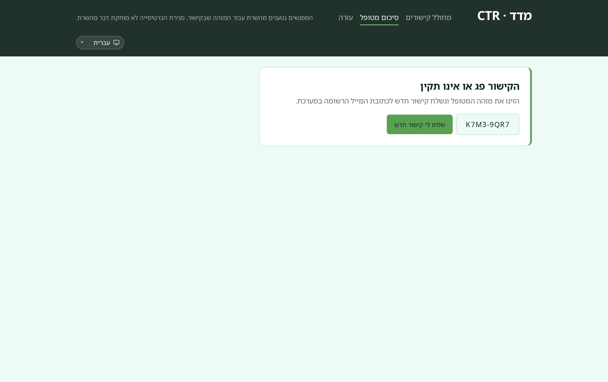

אם איבדתם את האימייל, היכנסו אל **[ctrmadad.com/aggregate](https://ctrmadad.com/aggregate/)** (הלשונית
**סיכום מטופל**), הזינו את מזהה המטופל ולחצו על **שלחו לי קישור**.

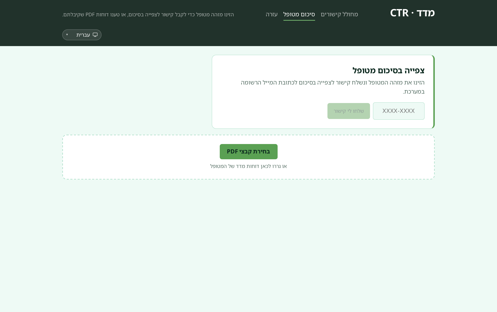

קישור חדש יישלח **רק לכתובת האימייל הרשומה שלכם**. העמוד מציג תמיד את
אותה הודעה, בין שהמזהה קיים ובין שלא.

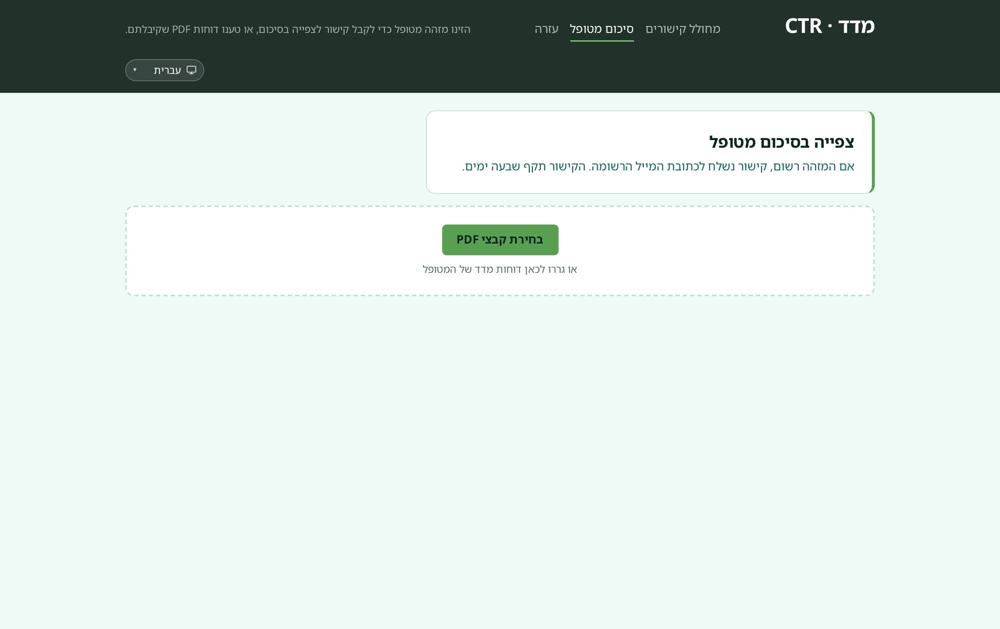

---

לשאלות: השיבו לכל אימייל ממדד, או כתבו אל madad@ctrmadad.com.
